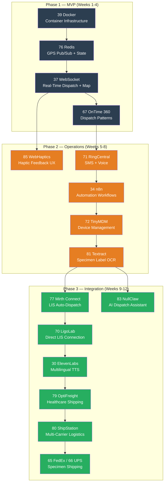

# Sample Pickup Driver — Relevant Experiments & Build Plan

**Feature:** Sample Pickup Driver Mobile Application
**PRD Source:** [SamplePickupDriver_PRD_v1.docx](00-SamplePickupDriver_PRD_v1.docx)
**Date:** March 12, 2026
**Status:** Pre-Discovery — Research Mode

---

## Feature Summary

A dispatcher-to-driver Progressive Web App for healthcare specimen logistics. Drivers receive pickup assignments via SMS link, confirm specimen handoff with photos, and stream GPS location every 2 seconds. The system provides real-time driver visibility, chain-of-custody photo proof, duty time tracking, and full HIPAA-compliant audit logging. The driver UI is designed for low-literacy users — icons, haptics, color, and audio are the primary communication channels.

**Key Technical Requirements:**
- PWA distributed via SMS link (zero app-store install)
- Real-time GPS telemetry at 2-second intervals (1,800 records/driver/hour)
- WebSocket live map for dispatchers
- Photo capture → S3 presigned URL upload (chain-of-custody proof)
- Twilio SMS for driver activation
- Haptic, audio (Web Speech API), and icon-driven UX
- HIPAA compliance (encryption, BAA, audit trail)
- Duty state machine: Off Duty → On Duty → En Route → At Location → Pickup Complete → Off Duty

---

## Relevant Experiments by Priority

### Must-Have for MVP (Phase 1)

| Exp | Name | Why It's Needed |
|-----|------|-----------------|
| **37** | [WebSocket](../../experiments/37-PRD-WebSocket-PMS-Integration.md) | **Core architecture.** Real-time dispatch push to driver app, live GPS position streaming to dispatcher map via `/location/stream` WebSocket endpoint. The PRD specifies WebSocket for backend→admin map push. |
| **76** | [Redis](../../experiments/76-PRD-Redis-PMS-Integration.md) | **GPS telemetry backbone.** Pub/Sub for fanning out 2-second GPS pings to dispatcher map subscribers. At 50 concurrent drivers = 90,000 inserts/hour — Redis handles the write volume and pub/sub fan-out before persisting to TimescaleDB/PostgreSQL. Also: driver session state caching, dispatch queue management. |
| **39** | [Docker](../../experiments/39-PRD-Docker-PMS-Integration.md) | **Container infrastructure.** GPS telemetry service, dispatch engine, S3 presigned URL generator, and WebSocket server all need containerized deployment. Docker Compose for local dev, production-ready images for deployment. |
| **67** | [OnTime 360](../../experiments/67-PRD-OnTime360API-PMS-Integration.md) | **Courier dispatch patterns.** OnTime 360 is a local courier dispatch and tracking platform — its API patterns for driver assignment, route tracking, and delivery confirmation directly map to this PRD's dispatch workflow. Evaluate as either a backend service or as a reference architecture. |

### High-Value for Phase 2

| Exp | Name | Why It's Needed |
|-----|------|-----------------|
| **85** | [WebHaptics](../../experiments/85-PRD-WebHaptics-PMS-Integration.md) | **Haptic feedback layer.** The PRD requires haptic feedback as a primary communication channel for low-literacy drivers. WebHaptics provides a lightweight TypeScript library with React hooks (`useWebHaptics`), built-in presets (success, nudge, error, buzz), and custom vibration patterns. Maps directly to PRD §8 — distinct patterns for pickup accepted, specimen scanned, photo uploaded, and error states. Depends on 37 WebSocket. |
| **71** | [RingCentral API](../../experiments/71-PRD-RingCentralAPI-PMS-Integration.md) | **SMS + voice.** Programmable SMS for driver activation links (alternative/complement to Twilio). Tap-to-call for driver→dispatcher and driver→clinic contact. The PRD requires SMS activation and tap-to-call — RingCentral provides both in a unified API with HIPAA BAA. |
| **34** | [n8n 2.0+](../../experiments/34-PRD-n8nUpdates-PMS-Integration.md) | **Workflow automation.** Dispatch → SMS → assignment → escalation chains. Auto-timeout duty-end triggers (30-min inactivity). Dispatcher alerts on GPS trail gaps. Notification workflows for lab/receiving team ETA updates. All without custom code. |
| **72** | [TinyMDM](../../experiments/72-PRD-TinyMDM-PMS-Integration.md) | **Device management.** If company-issued Android devices are used: remote wipe on driver termination, kiosk mode to lock device to the PWA, geofence enforcement policies, GPS permission enforcement. Essential for fleet-managed devices. |
| **81** | [Amazon Textract](../../experiments/81-PRD-AmazonTextract-PMS-Integration.md) | **Specimen label OCR.** Extract specimen IDs, patient identifiers, and test types from photographed specimen labels. Automates chain-of-custody data entry — driver takes photo, Textract reads the label, system logs structured data without manual typing. |

### Phase 3 Enhancements

| Exp | Name | Why It's Needed |
|-----|------|-----------------|
| **77** | [Mirth Connect](../../experiments/77-PRD-MirthConnect-PMS-Integration.md) | **LIS-triggered auto-dispatch.** When the lab information system generates a specimen collection order (HL7v2 ORM message), Mirth Connect routes it to the dispatch engine, automatically creating a pickup task. Closes the loop between lab orders and driver assignment. |
| **70** | [LigoLab MS SQL](../../experiments/70-PRD-LigoLab-PMS-Integration.md) | **Direct LIS integration.** Pull pending specimen collection orders directly from LigoLab's MS SQL database to auto-generate dispatch tasks. Complements Mirth Connect for LigoLab-specific deployments. |
| **17** | [HL7v2 LIS](../../experiments/17-PRD-HL7v2LIS-PMS-Integration.md) | **Lab order interoperability.** HL7v2 ORM/OBR messages trigger pickup task creation. HL7v2 ORU messages carry results back. Standard protocol for lab-to-dispatch communication. |
| **30** | [ElevenLabs](../../experiments/30-PRD-ElevenLabs-PMS-Integration.md) | **High-quality multilingual TTS.** The PRD uses Web Speech API for audio prompts ("New pickup assigned. Tap to accept."). ElevenLabs provides higher-quality, more natural voice synthesis with multilingual support — critical if drivers speak languages beyond English. |
| **79** | [OptiFreight](../../experiments/79-PRD-OptiFreight-PMS-Integration.md) | **Healthcare-specialized shipping.** Cardinal Health's OptiFreight manages 22M+ healthcare shipments/year. For specimens requiring long-distance transport to reference labs, OptiFreight provides healthcare-specific logistics with temperature tracking, compliance documentation, and cost optimization across 25,000 shipping locations. Complements local driver pickup for regional/national specimen routing. |
| **80** | [ShipStation API](../../experiments/80-PRD-ShipStationAPI-PMS-Integration.md) | **Multi-carrier specimen shipping.** 200+ carrier integrations with automated label creation, rate shopping, and webhook-driven tracking. When specimens must ship to external labs (Quest, LabCorp, specialty reference labs), ShipStation automates label generation from encounter data, compares carrier rates, and links tracking back to the patient record. |
| **65** | [FedEx API](../../experiments/65-PRD-FedExAPI-PMS-Integration.md) | **Long-distance specimen shipping.** If collected specimens need to be shipped to distant reference labs (not just driven locally), FedEx provides tracking, label generation, and temperature-sensitive shipment options. |
| **66** | [UPS API](../../experiments/66-PRD-UPSAPI-PMS-Integration.md) | **Cold-chain specimen logistics.** UPS healthcare logistics with temperature monitoring for temperature-sensitive specimens (blood, tissue). Cold-chain compliance tracking from pickup to lab delivery. |
| **83** | [NullClaw](../../experiments/83-PRD-NullClaw-PMS-Integration.md) | **Multi-channel dispatch AI assistant.** Ultra-lightweight (678 KB) AI assistant runtime that enables drivers and dispatchers to interact via Telegram, Slack, WhatsApp, or SMS. Drivers could query assignment status, report issues, or receive instructions through their preferred channel without opening the PWA. Dispatchers get a natural language interface for fleet management. Depends on 82 OpenRouter. |
| **51** | [Amazon Connect Health](../../experiments/51-PRD-AmazonConnectHealth-PMS-Integration.md) | **Contact center for dispatch.** If the dispatcher operation scales beyond a single admin portal — IVR for driver support calls, call recording for compliance, AI-powered call routing. |
| **82** | [OpenRouter](../../experiments/82-PRD-OpenRouter-PMS-Integration.md) | **AI gateway for intelligent features.** Route optimization suggestions, ETA calculations using LLM reasoning, voice prompt translation for multilingual drivers, intelligent dispatch assignment (match driver to pickup based on location/capacity). |
| **69** | [Azure Document Intelligence](../../experiments/69-PRD-AzureDocIntel-PMS-Integration.md) | **Alternative OCR.** If specimen labels include multilingual text or complex table formats where Azure outperforms Textract (100+ language support vs Textract's English focus). |
| **50** | [OWASP LLM Top 10](../../experiments/50-PRD-OWASPLLMTop10-PMS-Integration.md) | **Security assessment.** If AI/LLM features are added (route optimization, intelligent dispatch), security audit against OWASP LLM Top 10 vulnerabilities. |
| **58** | [Supabase + Claude Code](../../experiments/58-PRD-SupabaseClaudeCode-PMS-Integration.md) | **Alternative backend stack.** Supabase provides real-time subscriptions (live driver map without custom WebSocket), built-in auth (driver token validation), and storage (photo upload) — potentially simplifying the backend for this specific app. |

---

## Experiment-to-PRD Mapping

This table maps each PRD section to the experiments that address it:

| PRD Section | Primary Experiments | Supporting Experiments |
|-------------|--------------------|-----------------------|
| §3 Driver Activation (SMS link, token, PWA) | **71** RingCentral | 34 n8n (automation) |
| §4 Dispatch & Task Assignment | **67** OnTime 360, **37** WebSocket | 34 n8n, 76 Redis, 83 NullClaw (AI dispatch) |
| §5 Duty Time Tracking (state machine) | **76** Redis (state), **39** Docker | 34 n8n (auto-timeout) |
| §6 GPS Location Telemetry (2s pings) | **37** WebSocket, **76** Redis | 39 Docker |
| §7 Camera & Photo Capture (S3 upload) | **81** Textract (label OCR) | 69 Azure Doc Intel |
| §8 Haptic, Audio & Accessibility | **85** WebHaptics (haptic patterns), **30** ElevenLabs (TTS) | — |
| §9 Identity, Security & Compliance | **50** OWASP, **72** TinyMDM | — |
| §10 Backend Integration Points | **39** Docker, **37** WebSocket, **76** Redis | 58 Supabase |
| §12 Recommended Stack (TimescaleDB) | **76** Redis, **39** Docker | — |
| Lab order auto-dispatch (not in PRD yet) | **77** Mirth Connect, **70** LigoLab | 17 HL7v2 LIS |
| Specimen shipping (not in PRD yet) | **79** OptiFreight, **80** ShipStation | 65 FedEx, 66 UPS |
| Multi-channel driver comms (not in PRD yet) | **83** NullClaw | 82 OpenRouter, 51 Amazon Connect |

---

## Build Sequence

---

## Open Questions Impacting Experiment Selection

| PRD Open Question | Experiment Impact |
|-------------------|-------------------|
| Is reliable background GPS (screen-off) a hard requirement? | If yes → Capacitor native shell needed, not just PWA. **TinyMDM (72)** becomes more critical for enforcing device config. |
| Can a driver hold multiple concurrent assignments? | If yes → **OnTime 360 (67)** route optimization becomes essential. **Redis (76)** needs multi-task state management. |
| Does duty time feed into payroll or billing? | If yes → **Xero API (75)** for automated billing, **n8n (34)** for payroll export workflows. |
| What languages beyond English? | If multilingual → **ElevenLabs (30)** moves from Phase 3 to Phase 2. **Azure Doc Intel (69)** preferred over Textract for multilingual labels. |
| Is a Twilio BAA already in place? | If no → **RingCentral (71)** may be preferred (HIPAA BAA available). If yes → Twilio stays as primary SMS provider. |
| Are geofences needed for automatic arrival detection? | If yes → **Redis (76)** geofence computation, **n8n (34)** geofence-triggered workflows. |
| Do specimens ship to distant reference labs? | If yes → **OptiFreight (79)** for healthcare-optimized logistics, **ShipStation (80)** for multi-carrier rate shopping. FedEx (65) / UPS (66) become direct carrier integrations. |
| Should drivers interact via messaging apps (Telegram, WhatsApp)? | If yes → **NullClaw (83)** provides multi-channel AI assistant for dispatch queries and status updates without opening the PWA. |

---

## Related Documents

- [SamplePickupDriver_PRD_v1.docx](00-SamplePickupDriver_PRD_v1.docx) — Full PRD
- [Experiment Interconnection Roadmap](../../experiments/00-Experiment-Interconnection-Roadmap.md) — Master experiment dependency graph
- [WebSocket PRD](../../experiments/37-PRD-WebSocket-PMS-Integration.md) — Real-time communication foundation
- [Redis PRD](../../experiments/76-PRD-Redis-PMS-Integration.md) — GPS telemetry and pub/sub infrastructure
- [OnTime 360 PRD](../../experiments/67-PRD-OnTime360API-PMS-Integration.md) — Courier dispatch reference architecture
- [WebHaptics PRD](../../experiments/85-PRD-WebHaptics-PMS-Integration.md) — Haptic feedback for driver UX
- [OptiFreight PRD](../../experiments/79-PRD-OptiFreight-PMS-Integration.md) — Healthcare shipping logistics
- [ShipStation PRD](../../experiments/80-PRD-ShipStationAPI-PMS-Integration.md) — Multi-carrier specimen shipping
- [NullClaw PRD](../../experiments/83-PRD-NullClaw-PMS-Integration.md) — Multi-channel AI dispatch assistant
