# ReqScanner — Linear Experiment Roadmap

**Feature:** ReqScanner — Android Tablet Lab Requisition OCR Application
**PRD Source:** [ReqScan_PRD_1.docx](ReqScan_PRD_1.docx)
**Date:** March 13, 2026
**Status:** Pre-Discovery — Research Mode

---

## Feature Summary

An Android tablet kiosk application for digitizing paper lab requisition forms via OCR. The pipeline has three stages: (1) on-device image capture with OpenCV perspective correction and Google ML Kit OCR across 40 configurable zones, (2) AWS Lambda + Amazon Textract cloud verification with a 2-second SLA, and (3) structured data storage with full lineage. A human correction UI color-codes confidence levels (green ≥0.85, amber 0.65–0.85, red <0.65). Images upload to S3 via pre-signed URLs. The system targets ADG Dermatopathology and the MarginLogic partner network, with Phase 2 adding HL7/FHIR interfaces to laboratory information systems.

**Key Technical Requirements:**
- Android tablet (Kotlin/Jetpack Compose) in kiosk mode
- OpenCV perspective warp → 2550×3300 px at 300 DPI
- Google ML Kit Text Recognition v2 on-device (500 ms for 40 zones)
- AWS Lambda + Amazon Textract cloud verification (2-second SLA)
- Zone-based parsing: JSON config with `{x, y, width, height}` for up to 40 zones per template
- Confidence arbitration between device and cloud OCR results
- S3 pre-signed URL uploads (5-min expiry), bypassing API gateway
- Human correction UI with confidence color coding
- HIPAA compliance: TLS 1.3, AES-256/KMS, MDM, certificate pinning, device certs
- Phase 2: HL7/FHIR interface to LIS

---

## Linear Experiment Sequence

Each experiment builds on the previous one. Complete them in order — each step is a prerequisite for the next.

---

### Step 1: Docker (Experiment 39)

**Category:** Platform Infrastructure
**PRD Sections:** §10 Backend Services, §11 Infrastructure

| Aspect | Detail |
|--------|--------|
| **What** | Container infrastructure for all ReqScanner backend services |
| **Why first** | Every backend component — the Lambda-emulation service, S3 mock, PostgreSQL, and the FastAPI gateway — runs in Docker during development. Without containers, nothing else can be stood up locally. |
| **ReqScanner use** | `docker-compose.yml` defining: FastAPI backend, PostgreSQL, LocalStack (S3 + Lambda emulation), Redis, and the OCR verification service. Reproducible dev environment for all team members. |
| **Deliverable** | Running `docker compose up` spins up the full ReqScanner backend stack locally |

**Reference:** [Docker PRD](../../experiments/39-PRD-Docker-PMS-Integration.md)

---

### Step 2: Redis (Experiment 76)

**Category:** Caching & State Management
**PRD Sections:** §6 OCR Pipeline, §7 Confidence Arbitration, §10 Performance

| Aspect | Detail |
|--------|--------|
| **What** | In-memory cache for OCR pipeline state and result arbitration |
| **Why second** | The OCR pipeline is stateful: on-device results arrive first, then cloud results arrive up to 2 seconds later. Redis holds the intermediate state between pipeline stages, caches zone configurations per template, and stores session data for the human correction UI. |
| **ReqScanner use** | (1) Pipeline state: cache on-device ML Kit results keyed by `scan_id` while awaiting Textract response. (2) Zone config cache: store parsed zone JSON configs to avoid re-reading from DB on every scan. (3) Rate limiting: throttle Lambda invocations per tablet. (4) Pub/Sub: notify the correction UI when cloud results are ready. |
| **Deliverable** | Redis container in Docker stack; FastAPI endpoints can read/write pipeline state with <1 ms latency |

**Reference:** [Redis PRD](../../experiments/76-PRD-Redis-PMS-Integration.md)

---

### Step 3: Amazon Textract (Experiment 81)

**Category:** Cloud OCR Engine
**PRD Sections:** §6 Cloud Verification, §7 Confidence Arbitration

| Aspect | Detail |
|--------|--------|
| **What** | AWS Textract for cloud-side OCR verification of lab requisition forms |
| **Why third** | Textract is the core cloud OCR engine explicitly specified in the PRD. With Docker and Redis in place, this step builds the actual OCR verification pipeline: tablet uploads image to S3 → Lambda triggers Textract → results cached in Redis → confidence arbitration runs. |
| **ReqScanner use** | (1) `AnalyzeDocument` API for form extraction with key-value pairs. (2) Zone-level confidence scores compared against on-device ML Kit scores. (3) Confidence arbitration logic: if Textract confidence > ML Kit confidence for a zone, prefer Textract result. (4) Lambda function with 2-second timeout enforcing the SLA. |
| **Deliverable** | End-to-end pipeline: S3 upload → Lambda → Textract → Redis → arbitrated result JSON |

**Reference:** [Amazon Textract PRD](../../experiments/81-PRD-AmazonTextract-PMS-Integration.md)

---

### Step 4: WebSocket (Experiment 37)

**Category:** Real-Time Communication
**PRD Sections:** §7 Human Correction UI, §8 Real-Time Status

| Aspect | Detail |
|--------|--------|
| **What** | WebSocket server for pushing cloud OCR results back to the Android tablet in real time |
| **Why fourth** | The tablet submits an image and gets on-device results instantly, but cloud results arrive asynchronously (up to 2 seconds later). WebSocket pushes the arbitrated result back to the tablet the moment it's ready — no polling. Also powers the supervisor dashboard showing live scan status across all tablets. |
| **ReqScanner use** | (1) `/ws/scan/{scan_id}`: tablet subscribes after upload, receives arbitrated OCR result push. (2) `/ws/dashboard`: supervisor sees live scan activity, correction rates, and queue depth. (3) Redis Pub/Sub → WebSocket bridge: when Lambda writes results to Redis, the WebSocket server picks them up and pushes to subscribers. |
| **Deliverable** | Tablet receives cloud-verified OCR results via WebSocket within 2 seconds of image upload |

**Reference:** [WebSocket PRD](../../experiments/37-PRD-WebSocket-PMS-Integration.md)

---

### Step 5: TinyMDM (Experiment 72)

**Category:** Mobile Device Management
**PRD Sections:** §9 Security & Compliance, §11 Device Management

| Aspect | Detail |
|--------|--------|
| **What** | MDM platform for locking Android tablets into kiosk mode |
| **Why fifth** | The PRD specifies dedicated tablets in kiosk mode at clinic front desks. With the core OCR pipeline working (Steps 1–4), this step secures the deployment surface: tablets are locked to the ReqScanner app, cameras are permission-enforced, USB/Bluetooth are disabled, and remote wipe is available for lost devices. |
| **ReqScanner use** | (1) Kiosk mode: single-app lock to ReqScanner. (2) Policy enforcement: camera always on, USB disabled, no app sideloading. (3) Certificate provisioning: push device certificates for mutual TLS. (4) Remote management: wipe PHI on device loss, push app updates OTA. (5) Geofence: alert if tablet leaves clinic premises. |
| **Deliverable** | Tablets enrolled in TinyMDM with kiosk policy; app auto-launches on boot, no escape to home screen |

**Reference:** [TinyMDM PRD](../../experiments/72-PRD-TinyMDM-PMS-Integration.md)

---

### Step 6: OWASP LLM Top 10 (Experiment 50)

**Category:** Security Assessment
**PRD Sections:** §9 Security & Compliance, §12 HIPAA

| Aspect | Detail |
|--------|--------|
| **What** | Security audit of the OCR pipeline against OWASP Top 10 and LLM-specific vulnerabilities |
| **Why sixth** | Before going live with PHI, the entire pipeline needs a security review. The PRD requires HIPAA compliance — TLS 1.3, AES-256, certificate pinning, audit logging. This step validates that the pipeline built in Steps 1–5 meets those requirements and identifies gaps before any real patient data flows through. |
| **ReqScanner use** | (1) Audit S3 pre-signed URL security (expiry, IP restrictions, bucket policies). (2) Review Lambda execution role permissions (least privilege). (3) Validate certificate pinning implementation on Android. (4) Test for injection via crafted requisition forms (adversarial OCR input). (5) Verify audit log completeness for every PHI access. |
| **Deliverable** | Security assessment report with pass/fail per HIPAA control; all critical findings remediated |

**Reference:** [OWASP LLM Top 10 PRD](../../experiments/50-PRD-OWASPLLMTop10-PMS-Integration.md)

---

### Step 7: Azure Document Intelligence (Experiment 69)

**Category:** Complementary Cloud OCR
**PRD Sections:** §6 Cloud Verification, §7 Confidence Arbitration

| Aspect | Detail |
|--------|--------|
| **What** | Azure Document Intelligence as a complementary/fallback OCR engine alongside Textract |
| **Why seventh** | With Textract working (Step 3), adding Azure Doc Intelligence creates a dual-engine OCR strategy. When Textract confidence is low for specific zones (handwritten fields, faded ink, multilingual text), Azure's layout model and 100+ language support can fill the gap. The confidence arbitration logic now has three sources: ML Kit, Textract, and Azure. |
| **ReqScanner use** | (1) Fallback engine: invoked when Textract zone confidence < 0.65. (2) Handwriting specialty: Azure's prebuilt-read model excels at handwritten text common on requisition forms. (3) Three-way confidence arbitration: highest-confidence result wins per zone. (4) Cost optimization: Azure only invoked for low-confidence zones, not full pages. |
| **Deliverable** | Dual-engine OCR pipeline with per-zone routing; measurable improvement in accuracy for handwritten fields |

**Reference:** [Azure Document Intelligence PRD](../../experiments/69-PRD-AzureDocIntel-PMS-Integration.md)

---

### Step 8: OpenRouter (Experiment 82)

**Category:** AI Gateway
**PRD Sections:** §7 Confidence Arbitration, §8 Smart Validation

| Aspect | Detail |
|--------|--------|
| **What** | AI gateway for LLM-based field validation and semantic correction |
| **Why eighth** | OCR engines extract text but don't understand medical context. OpenRouter routes field values through an LLM for semantic validation: Is "Amoxicilin" a valid medication (→ correct to "Amoxicillin")? Is "DOB: 13/25/1990" a valid date? Does the ICD-10 code match the test ordered? This transforms raw OCR output into clinically validated structured data. |
| **ReqScanner use** | (1) Medication name validation and spelling correction via LLM. (2) ICD-10 code validation against the ordered test. (3) Date format normalization and sanity checking. (4) Provider NPI cross-reference. (5) Smart pre-fill: suggest values for blank required fields based on other form data. Cost-optimized by routing through the cheapest capable model per field type. |
| **Deliverable** | LLM validation layer reduces human correction rate by catching semantic errors OCR engines miss |

**Reference:** [OpenRouter PRD](../../experiments/82-PRD-OpenRouter-PMS-Integration.md)

---

### Step 9: AutoResearch (Experiment 84)

**Category:** Self-Improving AI
**PRD Sections:** §7 Human Correction Feedback Loop, §13 Continuous Improvement

| Aspect | Detail |
|--------|--------|
| **What** | Self-improving OCR pipeline that learns from human correction data |
| **Why ninth** | Every human correction is a training signal. When a technician fixes an OCR result, that correction pair (OCR output → correct value) feeds into AutoResearch to fine-tune zone-specific extraction models. Over time, the system gets better at reading specific form templates, specific handwriting styles, and specific field types — reducing the human correction rate toward zero. |
| **ReqScanner use** | (1) Collect correction pairs from the human correction UI. (2) Cluster corrections by zone type (patient name, DOB, ICD-10, medication). (3) Fine-tune zone-specific extraction prompts or models. (4) A/B test improved models against production baseline. (5) Track accuracy improvement per zone per template over time. |
| **Deliverable** | Automated retraining pipeline; measurable week-over-week reduction in human correction rate |

**Reference:** [AutoResearch PRD](../../experiments/84-PRD-AutoResearch-PMS-Integration.md)

---

### Step 10: Apache Kafka (Experiment 38)

**Category:** Event Streaming
**PRD Sections:** §10 Data Pipeline, §13 Audit Trail

| Aspect | Detail |
|--------|--------|
| **What** | Event streaming backbone for the corrections-to-retraining pipeline and audit trail |
| **Why tenth** | With AutoResearch consuming correction data (Step 9), Kafka provides the durable, ordered event stream connecting the human correction UI to the retraining pipeline. Every event — scan submitted, OCR result produced, correction made, model retrained — flows through Kafka topics, creating both a retraining data pipeline and a complete HIPAA audit trail. |
| **ReqScanner use** | (1) `scans.submitted` topic: image upload events. (2) `ocr.results` topic: pipeline stage results (ML Kit, Textract, Azure, LLM). (3) `corrections.made` topic: human correction events feeding AutoResearch. (4) `audit.trail` topic: every PHI access event for HIPAA compliance. (5) Consumer groups for real-time dashboards and batch retraining jobs. |
| **Deliverable** | All pipeline events flow through Kafka; AutoResearch consumes from correction topic; audit trail is durable and queryable |

**Reference:** [Apache Kafka PRD](../../experiments/38-PRD-ApacheKafka-PMS-Integration.md)

---

### Step 11: FHIR R4 (Experiment 16)

**Category:** Healthcare Interoperability
**PRD Sections:** Phase 2 — §14 LIS Integration

| Aspect | Detail |
|--------|--------|
| **What** | FHIR R4 resource definitions for lab order interoperability |
| **Why eleventh** | Phase 2 of the PRD requires sending structured OCR data to laboratory information systems. FHIR R4 is the modern standard — `ServiceRequest` for lab orders, `DiagnosticReport` for results, `Patient` for demographics. This step defines the FHIR resource mappings from the 40-zone OCR output to standard FHIR resources before building the transport layer. |
| **ReqScanner use** | (1) Map OCR zones to FHIR `ServiceRequest` fields (test codes, ordering provider, priority). (2) Map patient demographic zones to FHIR `Patient` resource. (3) Map specimen zones to FHIR `Specimen` resource. (4) Define a FHIR `Bundle` transaction for atomic submission. (5) Validate against US Core profiles. |
| **Deliverable** | FHIR R4 resource mappings for all 40 OCR zones; sample Bundle transactions validated against US Core |

**Reference:** [FHIR R4 PRD](../../experiments/16-PRD-FHIRR4-PMS-Integration.md)

---

### Step 12: Mirth Connect (Experiment 77)

**Category:** Integration Engine
**PRD Sections:** Phase 2 — §14 LIS Integration

| Aspect | Detail |
|--------|--------|
| **What** | Integration engine for routing FHIR/HL7 messages to laboratory information systems |
| **Why twelfth** | With FHIR resources defined (Step 11), Mirth Connect handles the transport: accepting the FHIR Bundle from the ReqScanner backend, transforming it to whatever format the target LIS expects (FHIR, HL7v2 ORM, proprietary), and routing it to the correct destination. Mirth handles protocol differences across labs. |
| **ReqScanner use** | (1) Inbound channel: receive FHIR Bundle from ReqScanner FastAPI backend. (2) Transformer: FHIR → HL7v2 ORM for legacy LIS systems. (3) Outbound channels: route to LigoLab, Quest, LabCorp, or other LIS endpoints. (4) Error handling: dead-letter queue for failed transmissions. (5) Audit: log every message for HIPAA. |
| **Deliverable** | OCR-extracted lab orders flow from ReqScanner → Mirth Connect → target LIS in the correct format |

**Reference:** [Mirth Connect PRD](../../experiments/77-PRD-MirthConnect-PMS-Integration.md)

---

### Step 13: HL7v2 LIS (Experiment 17)

**Category:** Legacy Lab Interoperability
**PRD Sections:** Phase 2 — §14 LIS Integration

| Aspect | Detail |
|--------|--------|
| **What** | HL7v2 message definitions for legacy LIS systems that don't support FHIR |
| **Why thirteenth** | Many labs still run on HL7v2. With Mirth Connect routing messages (Step 12), this step defines the specific HL7v2 ORM message structure for lab order submission — MSH, PID, ORC, OBR segments mapped from OCR zone data. Essential for LigoLab and other legacy systems. |
| **ReqScanner use** | (1) ORM^O01 message: new lab order from OCR data. (2) PID segment: patient demographics from OCR zones 1–8. (3) OBR segment: test orders from OCR zones 15–25. (4) ORC segment: ordering provider from OCR zones 30–35. (5) ACK handling: confirm LIS received the order. |
| **Deliverable** | HL7v2 ORM messages generated from OCR data; round-trip tested with LigoLab test instance |

**Reference:** [HL7v2 LIS PRD](../../experiments/17-PRD-HL7v2LIS-PMS-Integration.md)

---

### Step 14: LigoLab MS SQL (Experiment 70)

**Category:** Direct LIS Integration
**PRD Sections:** Phase 2 — §14 LIS Integration, §15 Partner Network

| Aspect | Detail |
|--------|--------|
| **What** | Direct MS SQL integration with LigoLab LIS for the MarginLogic partner network |
| **Why fourteenth (final)** | The PRD targets ADG Dermatopathology and MarginLogic partners, who use LigoLab. While Mirth Connect + HL7v2 provides standard interoperability (Steps 12–13), direct SQL integration with LigoLab enables richer features: query existing patient records before OCR to pre-fill fields, check for duplicate orders, and pull specimen tracking status. This is the final step that completes the end-to-end pipeline from paper form to LIS. |
| **ReqScanner use** | (1) Patient lookup: query LigoLab for existing patient by MRN/DOB before OCR submission — pre-fill demographics. (2) Duplicate detection: check for existing orders matching the scanned requisition. (3) Order insertion: write validated OCR data directly to LigoLab tables (bypassing HL7 for speed). (4) Status tracking: pull specimen processing status back into ReqScanner dashboard. |
| **Deliverable** | Full round-trip: paper requisition → OCR → validated data → LigoLab database → specimen tracking |

**Reference:** [LigoLab MS SQL PRD](../../experiments/70-PRD-LigoLab-PMS-Integration.md)

---

## Visual Roadmap

```mermaid
flowchart TB
    subgraph MVP["Phase 1 — MVP Pipeline (Steps 1–6)"]
        S1["① 39 Docker<br/>Container Infrastructure"]
        S2["② 76 Redis<br/>Pipeline State Cache"]
        S3["③ 81 Amazon Textract<br/>Cloud OCR Engine"]
        S4["④ 37 WebSocket<br/>Real-Time Result Push"]
        S5["⑤ 72 TinyMDM<br/>Kiosk & Device Security"]
        S6["⑥ 50 OWASP Top 10<br/>Security Audit"]
    end

    subgraph ENHANCE["Phase 2 — Intelligence (Steps 7–10)"]
        S7["⑦ 69 Azure Doc Intel<br/>Dual OCR Engine"]
        S8["⑧ 82 OpenRouter<br/>LLM Field Validation"]
        S9["⑨ 84 AutoResearch<br/>Self-Improving OCR"]
        S10["⑩ 38 Apache Kafka<br/>Event Streaming"]
    end

    subgraph LIS["Phase 3 — LIS Integration (Steps 11–14)"]
        S11["⑪ 16 FHIR R4<br/>Resource Mappings"]
        S12["⑫ 77 Mirth Connect<br/>Integration Engine"]
        S13["⑬ 17 HL7v2 LIS<br/>Legacy Lab Protocol"]
        S14["⑭ 70 LigoLab MS SQL<br/>Direct LIS Connection"]
    end

    S1 --> S2
    S2 --> S3
    S3 --> S4
    S4 --> S5
    S5 --> S6

    S6 --> S7
    S7 --> S8
    S8 --> S9
    S9 --> S10

    S10 --> S11
    S11 --> S12
    S12 --> S13
    S13 --> S14

    style S1 fill:#1e3a5f,color:#fff
    style S2 fill:#1e3a5f,color:#fff
    style S3 fill:#1e3a5f,color:#fff
    style S4 fill:#1e3a5f,color:#fff
    style S5 fill:#1e3a5f,color:#fff
    style S6 fill:#1e3a5f,color:#fff
    style S7 fill:#7c3aed,color:#fff
    style S8 fill:#7c3aed,color:#fff
    style S9 fill:#7c3aed,color:#fff
    style S10 fill:#7c3aed,color:#fff
    style S11 fill:#047857,color:#fff
    style S12 fill:#047857,color:#fff
    style S13 fill:#047857,color:#fff
    style S14 fill:#047857,color:#fff
```

---

## Experiment-to-PRD Zone Mapping

| PRD Requirement | Experiment(s) | OCR Zones Affected |
|-----------------|---------------|--------------------|
| Image capture & perspective correction | (Native Android — no experiment) | All 40 zones |
| On-device OCR (ML Kit) | (Native Android — no experiment) | All 40 zones |
| Cloud OCR verification | **81** Textract, **69** Azure Doc Intel | All 40 zones |
| Pipeline state management | **76** Redis | — (infrastructure) |
| Real-time result delivery | **37** WebSocket | — (transport) |
| Confidence arbitration | **81** Textract + **69** Azure + **82** OpenRouter | All 40 zones |
| Semantic field validation | **82** OpenRouter | Medication, ICD-10, NPI, dates |
| Human correction UI | **37** WebSocket, **76** Redis | Low-confidence zones (<0.85) |
| Self-improving accuracy | **84** AutoResearch, **38** Kafka | Historically low-confidence zones |
| S3 image upload | **39** Docker (LocalStack dev) | — (storage) |
| Kiosk mode & device security | **72** TinyMDM | — (device policy) |
| HIPAA compliance audit | **50** OWASP Top 10 | — (all PHI flows) |
| LIS lab order submission | **16** FHIR, **77** Mirth, **17** HL7v2 | Zones 1–8 (patient), 15–25 (tests), 30–35 (provider) |
| LigoLab direct integration | **70** LigoLab MS SQL | All mapped zones |

---

## Related Documents

- [ReqScan_PRD_1.docx](ReqScan_PRD_1.docx) — Full PRD
- [Experiment Interconnection Roadmap](../../experiments/00-Experiment-Interconnection-Roadmap.md) — Master experiment dependency graph
- [Amazon Textract PRD](../../experiments/81-PRD-AmazonTextract-PMS-Integration.md) — Core cloud OCR engine
- [Azure Document Intelligence PRD](../../experiments/69-PRD-AzureDocIntel-PMS-Integration.md) — Complementary OCR engine
- [OpenRouter PRD](../../experiments/82-PRD-OpenRouter-PMS-Integration.md) — AI gateway for field validation
- [AutoResearch PRD](../../experiments/84-PRD-AutoResearch-PMS-Integration.md) — Self-improving OCR pipeline
- [TinyMDM PRD](../../experiments/72-PRD-TinyMDM-PMS-Integration.md) — Android device management
- [FHIR R4 PRD](../../experiments/16-PRD-FHIRR4-PMS-Integration.md) — Healthcare interoperability standard
- [Mirth Connect PRD](../../experiments/77-PRD-MirthConnect-PMS-Integration.md) — Integration engine for LIS routing
- [LigoLab PRD](../../experiments/70-PRD-LigoLab-PMS-Integration.md) — Direct LIS database integration
